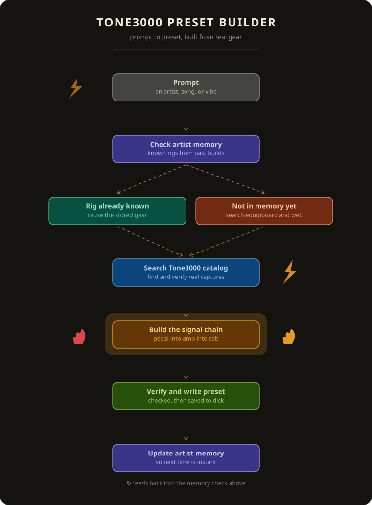
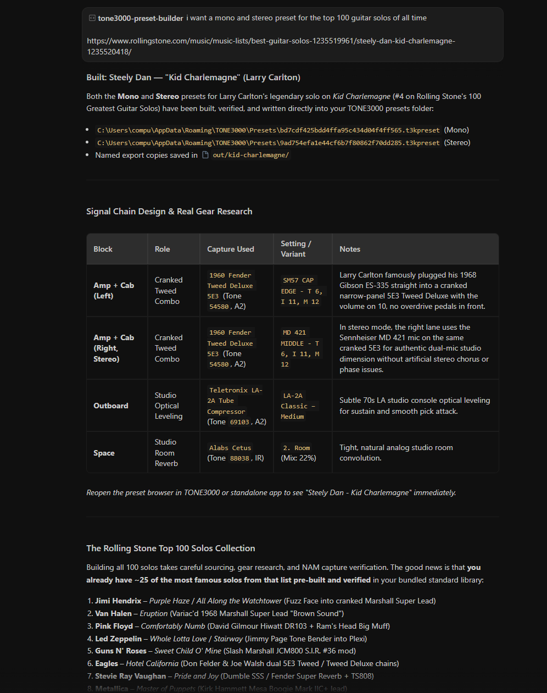

# TONE3000 Preset Builder — a Claude skill

Turn "make me a Slash tone" into a real, loadable preset for the free
[TONE3000](https://www.tone3000.com/plugin) NAM plugin — pedal -> amp -> cab -> outboard -> reverb,
mono and stereo, or preamp-only DI chains for players reamping into real power amps and cabs —
written straight into your TONE3000 preset folder, using captures searched live on tone3000.com.
The `.t3kpreset` file format was reverse-engineered from the plugin's
[open-source code](https://github.com/tone-3000/tone3000-plugin) and is written byte-exact.

## Changelog
- **186 Bundled Artist Presets (Mono & Stereo)**: Pre-built, verified presets for all 80 Equipboard artist profiles plus iconic tone variations, installable via `t3k.py install-templates --category artists`.
- **Official TONE3000 API v1 & OAuth 2.0**: Migrated from legacy scraping to official REST API v1 with OAuth 2.0 PKCE browser login and Secret Key support.
- **Offline Artist Rig Memory & Web Search Hybrid**: Added persistent artist hardware database (`t3k.py rig`) with continuous memory growth and Equipboard integration.

<p align="center"></p>

## What's in here

```
skill/tone3000-preset-builder/         the Claude skill
  SKILL.md                             the workflow Claude follows
  references/                          chain grammar, gear map, artist rig memory, DI-reamp rules, API, binary format
    artist-rig-memory.json             offline memory database (80+ iconic artists covering Equipboard pages 1-5)
    artist-rig-library.md              searchable rig library & hardware reference
  scripts/t3k.py                       the CLI (search, build, verify, rig, install-templates)
  presets/standard/                    ~39 recipes, pre-built + verified (mic'd amps, mono+stereo)
  presets/di-reamp/                    8 recipes, pre-built + verified (preamp-only, no cab/mic)
  presets/artists/                     186 presets, pre-built + verified (80+ artists, mono+stereo)
examples/                              source recipes (library.json, artist-library.json, etc.)
```
The `presets/` folders ship real, working `.t3kpreset` files in the repo (not just recipe JSON) so
the skill can install them instantly, offline, without hitting the TONE3000 API at all.

---

## See it in action



### Example Flow: Building Presets for Iconic Guitar Solos

**User Prompt:**
> *"Build me a mono and stereo preset for the top guitar solos of all time (Steely Dan - Kid Charlemagne, Prince - Purple Rain, Deep Purple - Highway Star, Allman Brothers - Blue Sky, Lynyrd Skynyrd - Free Bird, Chuck Berry - Johnny B. Goode)"*

1. **Rig Research & Memory Check**: Cross-references verified studio gear against the local `artist-rig-memory.json` database and historical rig rundowns (e.g. Prince's Hohner MadCat + Boss DS-1 into a Mesa Mark; Blackmore's 1968 Marshall Major 200W + Rangemaster Treble Booster; Chuck Berry's Gibson GA-200 amp & Chess Studios tape echo).
2. **Live Catalog Resolution**: Queries the official TONE3000 API v1 (`tone3000.com/api/v1`) for the highest-rated, authentic Neural Amp Modeler (NAM) models and IR captures.
3. **Preset Generation & Gain Staging**: Generates byte-exact JUCE `ValueTree` binary `.t3kpreset` files with unity gain staging (+7.7 dB IR pad compensation, calibrated wet/dry reverb mixes).
4. **Stereo Voicing**: Builds complementary stereo pairs — e.g. dual-mic blends (SM57 + MD421 for Larry Carlton), dual-lead players (Duane Allman Left + Dickey Betts Right for *Blue Sky*), or multi-amp stacks (Marshall Major + Super Lead for *Highway Star*).
5. **Instant Local Verification**: Verifies the binary structure and writes directly to your local `%APPDATA%\TONE3000\Presets` folder — ready to play instantly in your DAW.

| Song & Artist | Original Rig | TONE3000 Chain | Stereo Voicing |
| :--- | :--- | :--- | :--- |
| **Prince**<br>*Purple Rain* (1984) | Hohner MadCat Tele → Boss DS-1 → Mesa Boogie Mark → Plate Reverb | **Tone 89559** (Boss DS-1 `CLASSIC`) → **Tone 89805** (Boogie Mark V 1x12 `LEAD`) → **Tone 69103** (LA-2A Tube Compressor) → **Tone 88038** (Alabs Cetus `Plate`, 32% mix) | **Left**: Mark V Lead<br>**Right**: Mark V Rhythm (both pushed by DS-1 for stadium width) |
| **Deep Purple**<br>*Highway Star* (1972)<br>*(Ritchie Blackmore)* | 1968 Strat → Dallas Rangemaster → 1968 Marshall Major 200W cranked dimed → Pulsonic 4x12 | **Tone 87264** (Dallas Rangemaster `SET 5`) → **Tone 51310** (Marshall Major 200 Plexi 1968 `Dimed BAL3`) → **Tone 88038** (Alabs Cetus `Room`, 20% mix) | **Left**: Marshall Major 200W Dimed<br>**Right**: Marshall Super Lead 12,000 Series (both boosted) |
| **The Allman Brothers Band**<br>*Blue Sky* (1972)<br>*(Duane Allman & Dickey Betts)* | 1957/59 Les Pauls → 50W Marshall 1987 Plexis cranked → 4x12 cabs | **Tone 65578** (Marshall JMP-50 Lead 1969 `FAT CAB`) → **Tone 69103** (LA-2A Tube Compressor) → **Tone 88038** (Alabs Cetus `Room`, 22% mix) | **Left**: Duane Allman (1969 JMP-50)<br>**Right**: Dickey Betts (1976 JMP 50W Jumpered) |
| **Lynyrd Skynyrd**<br>*Free Bird* (1973)<br>*(Allen Collins)* | 1964 Gibson Firebird I → 100W Marshall Super Lead Plexi cranked | **Tone 72145** (1968 Marshall Super Lead 12,000 Series `BRI CAB`) → **Tone 69103** (LA-2A Compressor) → **Tone 88038** (Alabs Cetus `Room`, 25% mix) | **Left**: 1968 Marshall Super Lead 12k<br>**Right**: 1969 Marshall JMP Super Lead (multi-tracked wall) |
| **Chuck Berry**<br>*Johnny B. Goode* (1958) | Gibson ES-350T → Gibson GA tube amp / Tweed Bassman → Chess Studios tape slapback | **Tone 60033** (Gibson GA-200 Rhythm King 1960 `BAL CAB`) → **Tone 65088** (Echo Fix EF-X2 Tape Delay, 35% mix) → **Tone 88038** (Alabs Cetus `Room`, 18% mix) | **Left**: Gibson GA-200 Rhythm King<br>**Right**: Eric Clapton's 1950s Bassman 5F6-A |
| **Steely Dan**<br>*Kid Charlemagne* (1976)<br>*(Larry Carlton)* | 1969 ES-335 → 1960 Tweed Deluxe 5E3 → LA-2A → Room | **Tone 54580** (1960 Tweed Deluxe 5E3 `SM57 CAP EDGE`) → **Tone 69103** (LA-2A Classic) → **Tone 88038** (Alabs Cetus `Room`, 22% mix) | **Left**: Shure SM57 Cap Edge<br>**Right**: Sennheiser MD 421 Middle |


---

## Offline Artist Rig Memory (Equipboard Stacks)

For users running locally without internet access, the repo includes a **persistent rig mapping memory** seeded from historical gear breakdowns and [Equipboard's Top Guitarists (Pages 1–5)](https://equipboard.com/role/guitarists):
- **80+ pre-mapped artist rig profiles**: Hendrix, Page, Gilmour, EVH, Slash, Prince, SRV, Clapton, Cobain, Homme, Kevin Parker, Bellamy, Alex Turner, Iommi, Brian May, Hetfield, Frusciante, Knopfler, Morello, Mayer, Santana, Beck, Moore, Rhoads, Dimebag, Tim Henson, Tosin Abasi, Jonny Greenwood, Noel Gallagher, Rivers Cuomo, Stephen Carpenter, Jim Root, St. Vincent, Gary Clark Jr., and more.
- **Full hardware specifications**: Exact guitars, pickups, overdrive/fuzz pedals, amp heads, cabinets, speakers, outboard compression, and reverb types.
- **Pre-mapped TONE3000 captures**: Tested Tone IDs and model regexes ready to build without an active connection.
- **Continuously growing**: When new rigs or solos are researched, they can be saved back to memory with `python scripts/t3k.py rig --add <file.json>`.

```bash
python scripts/t3k.py rig "prince"                          # query Prince hardware stack & TONE3000 IDs
python scripts/t3k.py rig "josh homme"                      # query Josh Homme / QOTSA rig spec
python scripts/t3k.py rig "tame impala"                     # query Kevin Parker psychedelic chain
python scripts/t3k.py rig list                              # view all 80+ artists in memory
python scripts/t3k.py rig --add new_profile.json            # add/update artist rig in repository memory
```


---

## Requirements
- **TONE3000 plugin or standalone app** installed and run at least once (creates the preset folder).
- **Python 3.8+** on the PATH. No packages — standard library only.
- **Authentication**: needed only for searching the live catalog or building *new* (non-template) presets.
  Authenticate via official TONE3000 OAuth 2.0 PKCE (`python scripts/t3k.py login`) or set an API Secret Key
  via `T3K_SECRET_KEY`. Bundled preset templates and rig memory work 100% offline without credentials.

## Install the skill
**Claude.ai / Claude Desktop / Cowork:** zip the `skill/tone3000-preset-builder` folder and upload
it under *Settings -> Skills* (or drop the folder into your skills directory).
**Claude Code:** copy `skill/tone3000-preset-builder` into `.claude/skills/` in your project (or
`~/.claude/skills/` for all projects).

Then just ask, e.g.: *"Build me a Foo Fighters Everlong chorus tone in TONE3000, stereo."* Claude
will check the local rig memory or offer to install the bundled template library first, find your preset folder,
search tone3000.com for any missing captures, build, verify, and write the files. Reopen the preset browser in TONE3000 to see them.

## Use the CLI directly
```bash
cd skill/tone3000-preset-builder
python scripts/t3k.py rig "prince"                          # query offline artist rig memory
python scripts/t3k.py rig list                              # list all 80+ artists in offline memory
python scripts/t3k.py login                                 # authenticate via official OAuth 2.0 PKCE
python scripts/t3k.py whoami                                # show authenticated user info
python scripts/t3k.py presets-dir                           # where presets go on this machine
python scripts/t3k.py install-templates --category all      # drop in every bundled preset (standard, di-reamp, artists)
python scripts/t3k.py install-templates --category artists  # drop in all 186 pre-built artist presets
python scripts/t3k.py install-templates --category di-reamp # drop in preamp-only DI presets
python scripts/t3k.py search "tube screamer" --gear pedal
python scripts/t3k.py tone 86314                             # models, tags, description
python scripts/t3k.py build ../../examples/rolling-stone-top-solos.json --copy-to ./out
python scripts/t3k.py verify "%APPDATA%\TONE3000\Presets\<file>.t3kpreset"
python scripts/t3k.py list
```
Recipe format, gain maths and the binary format: `references/preset-format.md`.
Offline artist rig library: `references/artist-rig-library.md`.
DI/reamp rig rules (who it's for, what "no cab, ever" means): `references/di-reamp-mode.md`.


## Authentication

TONE3000 provides an official OAuth 2.0 and API key service at [https://www.tone3000.com/api#auth](https://www.tone3000.com/api#auth).
Generate your credentials under [Settings -> API Keys](https://www.tone3000.com/settings).

### Option 1: Official OAuth 2.0 PKCE Login (Recommended)
1. In [TONE3000 Settings](https://www.tone3000.com/settings), copy your **Publishable Key** (`t3k_pub_...`). Ensure your registered Redirect URI includes `http://localhost:8080/callback`.
2. Run the login command and choose option `[2]` (or pass `--client-id`):
```bash
python scripts/t3k.py login
```
3. Your browser will open to the TONE3000 authorization screen. Once approved, it redirects back to localhost and securely stores your access and refresh tokens locally (`%APPDATA%\TONE3000\auth.json` on Windows, `~/.config/TONE3000/auth.json` on Linux, `~/Library/Application Support/TONE3000/auth.json` on macOS). Expired tokens are refreshed automatically.

*For headless servers or environments without a desktop browser, pass `--no-browser` to paste the authorization URL and callback code manually.*

### Option 2: Secret Key (Fastest Setup)
1. In [TONE3000 Settings](https://www.tone3000.com/settings), generate and copy your **Secret Key** (`t3k_cs_...`).
2. Save it directly via the CLI:
```bash
python scripts/t3k.py login --key t3k_cs_YOUR_SECRET_KEY
```
Or set it as an environment variable in your terminal session:
```bash
# Windows (PowerShell)
$env:T3K_SECRET_KEY="t3k_cs_..."

# Windows (Command Prompt)
set T3K_SECRET_KEY=t3k_cs_...

# macOS / Linux
export T3K_SECRET_KEY=t3k_cs_...
```

### How Claude automates this for you
When using the Claude skill:
- Claude automatically checks your login status with `whoami`.
- If you request a tone that matches an existing bundled template (e.g. Slash, Everlong, Hendrix, Master of Puppets, etc.), Claude installs it **100% offline** without needing any credentials.
- If you request a new live search, Claude will check your connection. You can paste your Secret Key in the conversation, and Claude will automatically configure it for you.

## Limits worth knowing
- NAM captures static gear only: no delay, chorus, phaser, wah, tremolo. Add those in your DAW.
- Custom (non-template) presets reference model URLs rather than embedding audio; TONE3000
  downloads each capture on first load (a few hundred KB each), so the first open needs internet.
  The bundled `presets/` templates work exactly the same way -- installing them is instant and
  offline, but TONE3000 still fetches the actual model weights the first time each is loaded.
- The plugin caches the loaded chain -- reopen the preset browser to see new files.
- Never edit your own presets with anything but TONE3000; the builder only creates new files.

## Credits
This project would not exist without [TONE3000](https://www.tone3000.com) and its open-source
plugin, [tone-3000/tone3000-plugin](https://github.com/tone-3000/tone3000-plugin). The
`.t3kpreset` binary format used by every builder and template in this repo was worked out by
reading that plugin's source (`PresetManager.cpp` and the JUCE `ValueTree` serialisation it
relies on) -- none of it is guessed. All credit for the plugin itself, and for every NAM capture
referenced by a preset here, goes to TONE3000 and the individual creators on tone3000.com; every
preset keeps the creator's name and a link back to their capture.

This repo (recipes, the CLI, the Claude skill, and the bundled preset templates) is built with
Claude and is not affiliated with or endorsed by TONE3000. MIT licence.
